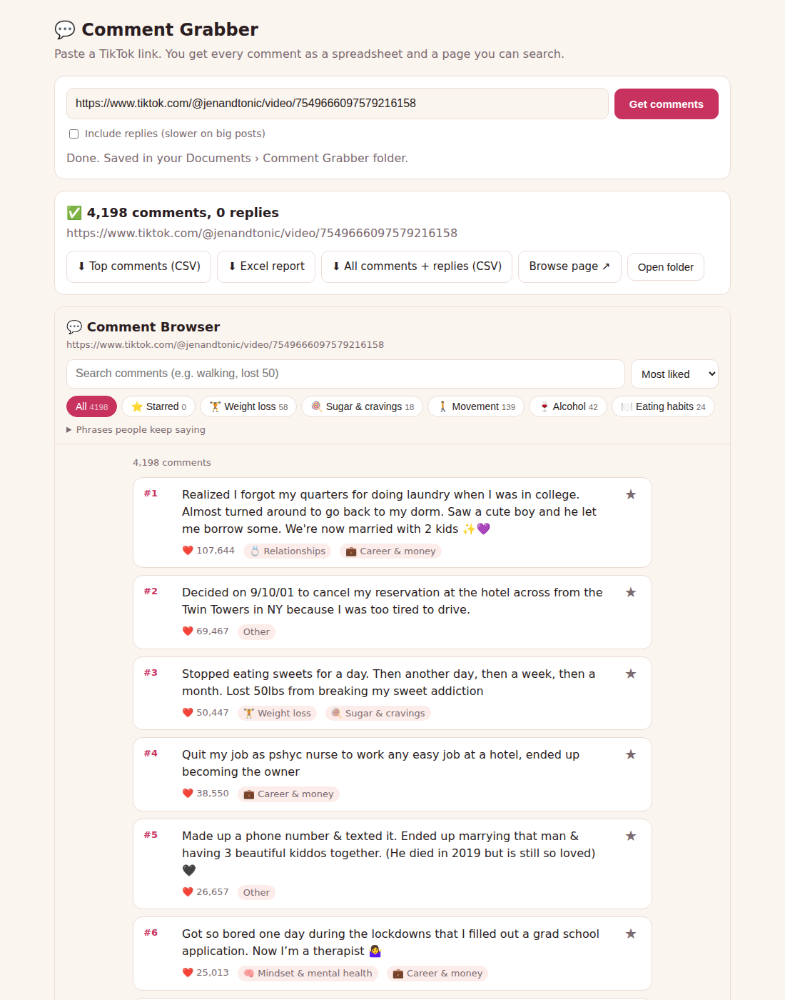

# Comment Grabber

Paste a TikTok link and get every comment from that post. It runs on your own computer and opens in your web browser.



## Using it (Windows)
1. Download **CommentGrabber.exe** (see "Getting the .exe" below) and put it anywhere, for example your Desktop.
2. Double-click it. A black window opens (keep it open) and the app opens in your web browser.
3. Paste a TikTok link (a normal link or a short `vm.tiktok.com` link) and press **Get comments**.
4. Untick **Include replies** if you only want the main comments. Replies make big posts much slower.

A post with about 4,000 comments takes 1 to 2 minutes without replies.

## What you get
Each post gets its own folder in `Documents\Comment Grabber\<account>-<video id>\`:

| File | What's in it |
|---|---|
| `top-comments.csv` | Just 3 columns: likes, comment, replies. Most liked first. No usernames. |
| `report.xlsx` | Excel with tabs: Overview (chart + phrases people keep saying), Top Liked, Comments, Replies, and one tab per topic. No usernames. |
| `report.html` | A page to search, filter by topic, sort, see replies and star favourites. |
| `all-comments.csv` | Everything, with usernames, dates and which comment each reply belongs to. |

The **Past grabs** list lets you open any post you grabbed before.

Topics (Weight loss, Relationships, Questions...) come from word lists at the top of `tools/comment_report.py`. Edit them to change the topics.

## Getting the .exe
Every change to this folder is built into a Windows .exe on GitHub and tested there by grabbing 50 real comments. On GitHub, go to **Actions**, then **Build Comment Grabber (Windows)**, open the latest green run, and download **CommentGrabber-Windows** at the bottom. Unzip it to get `CommentGrabber.exe`.

Windows may say "Windows protected your PC" the first time. Click **More info**, then **Run anyway**.

## Running from source (any computer)
```
pip install -r requirements.txt
python app.py
```
The same code also works from the command line: `tools/tiktok_comments.py` (grab) and `tools/comment_report.py` (report).
